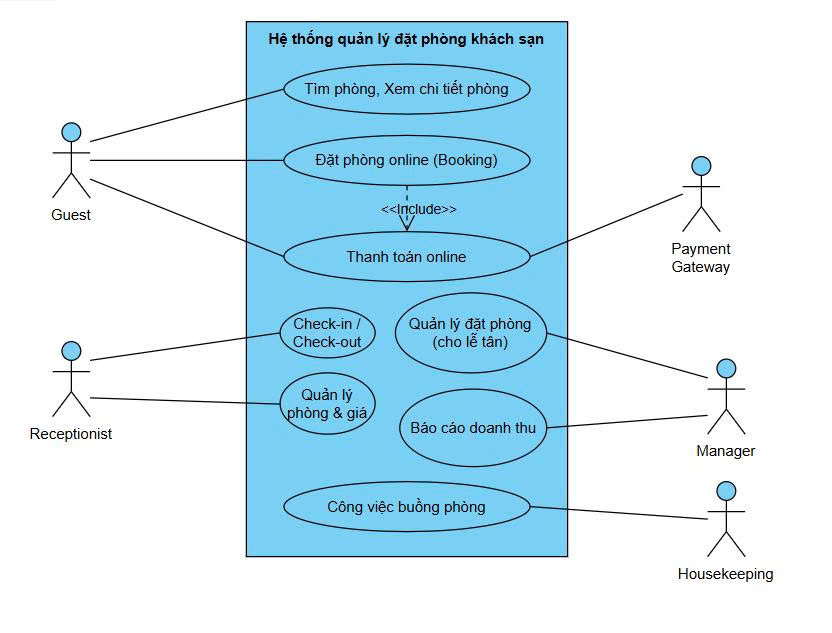

🛠️ Hotel Booking System
📌 Giới thiệu
Dự án này được phát triển trong môn Nhập môn Công nghệ Phần mềm.
Mục tiêu là áp dụng quy trình phát triển phần mềm, từ phân tích yêu cầu, thiết kế, lập trình, kiểm thử và triển khai.
## 👥 Thành viên nhóm
- Phạm Thị Tâm Như – Leader
-Võ Nguyễn Hà Giang – Developer
- Nguyễn Lê Tường Vi – Tester

## 🎯 Use Case chính
- Quản lý đặt phòng
- Hủy đặt phòng
- Thanh toán
- Xem tình trạng phòng

### Use Case Diagram

### Thiết kế hệ thống
  
  

## ⚙️ Công nghệ sử dụng
- Ngôn ngữ: JavaScript / Java / MySQL
- Công cụ UML: draw.io
- IDE: VS Code, IntelliJ IDEA

## ✅ Kết quả
- Vẽ được Use Case, Sequence, ERD.  
- Có thể mở rộng để triển khai hệ thống đặt phòng thực tế.
