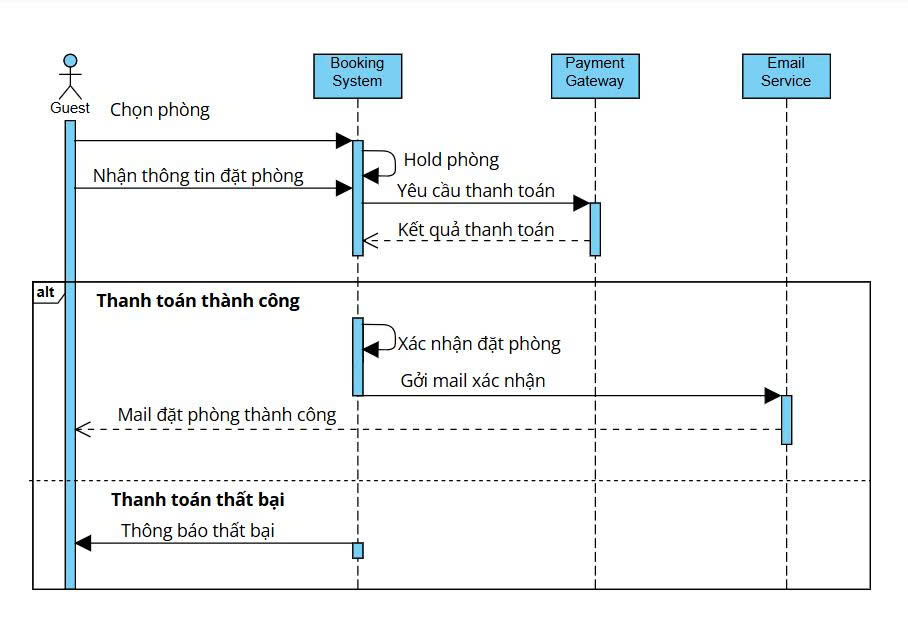

ATM Mini Project
## Giới thiệu
Dự án trạm rút tiền 

## Thành viên nhóm
- Võ Nguyễn Hà Giang – Leader  
- Phạm Thị Tâm Như – Developer  
- Nguyễn Lê Tường Vi– Tester  

## Use Case chính
- Đăng nhập
- Rút Tiền
- Gửi Tiền
- Kiểm tra số dư
- In biên lai  

## Thiết kế hệ thống
  

## Công nghệ sử dụng
- Ngôn ngữ: Java / Python / JavaScript / PHP  
- CSDL: MySQL  

## Kết quả
- Hệ thống hỗ trợ các Use Case chính.  
- CSDL được thiết kế và xây dựng như diagram.  
